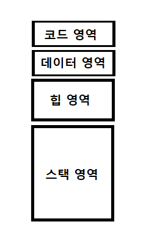

## 🦥 메모리 구조

- 위 그림과 같이 메모리 공간은 크게 4가지 영역으로 나눌 수 있다.
- 코드 영역 / 데이터 영역 / 힙 영역 / 스택 영역

---

### 코드 영역

- 실행할 프로그램의 코드가 저장되는 영역이며, 컴파일 타임에 결정되고 중간에 수정할 수 없다.
- 텍스트 영역이라고도 부른다.

---

### 데이터 영역

- 전역변수와 Static변수(정적 변수)가 저장되는 영역이다.
- 프로그램의 시작과 동시에 메모리 공간에 할당되며, 프로그램이 끝날 때까지 남아있다.

---

### 스택 영역

- 지역변수와 매개변수가 저장되는 영역이다.
- 함수 호출 시 할당되며, 함수를 종료하게 되면 소멸한다.
- 스택에 저장된 데이터는 LIFO(Last-In First-Out) 방식으로 저장된 순서의 역순으로 소멸한다.
- 지나치게 많은 변수를 사용하거나 재귀함수를 무한 호출하게 되어 스택 영역을 벗어나게 되면 스택 오버플로우가 발생한다.

---

### 힙 영역

- 프로그래머가 필요할 때마다 임의로 할당하고 해제할 수 있는 영역이다.
- 다른 영역이 컴파일 타임에 결정되는 것과는 다르게 런타임에 크기가 결정된다. 
- C에서는 malloc, realloc 등의 함수를, C++에서는 new 를 통해 메모리를 할당하고, 반드시 free 또는 delete로 할당한 메모리를 해제해 주어야 한다.
- 할당한 메모리를 해제하지 않은 채로 주소를 잃어버리면 더 이상 해당 메모리를 사용하거나 해제할 수 없으며, 이를 메모리 누수(leak) 이라고 한다.
- 스택에 비해 데이터를 읽고 쓰는 속도가 느리다는 단점이 있다.
